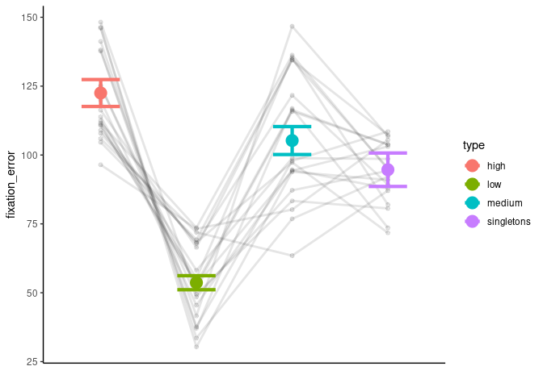
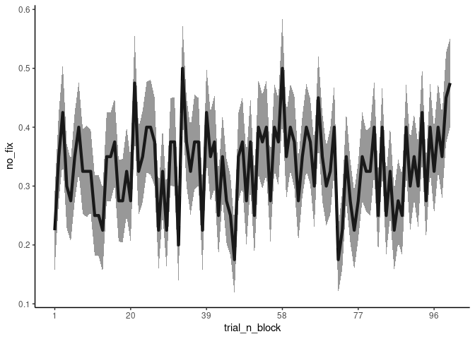

Scripts that analyze eye tracking data and count the missing cases

First, get the data

Plot the results by prediction error

    ## Automatically converting the following non-factors to factors: type

    ## `summarise()` has grouped output by 'participant'. You can override using the
    ## `.groups` argument.
    ## No summary function supplied, defaulting to `mean_se()`
    ## No summary function supplied, defaulting to `mean_se()`

    ## Saving 7 x 5 in image
    ## No summary function supplied, defaulting to `mean_se()`
    ## No summary function supplied, defaulting to `mean_se()`

Now the number of NAs by participant

    ## Automatically converting the following non-factors to factors: trial_n_block

    ## `summarise()` has grouped output by 'trial_n_block'. You can override using the
    ## `.groups` argument.

    ## Saving 7 x 5 in image
